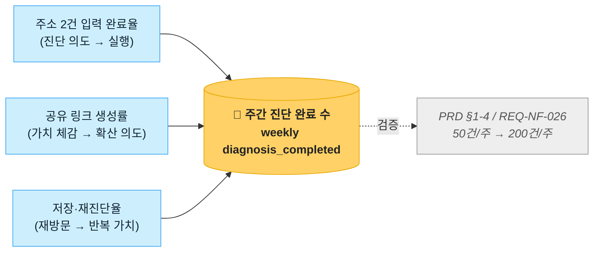
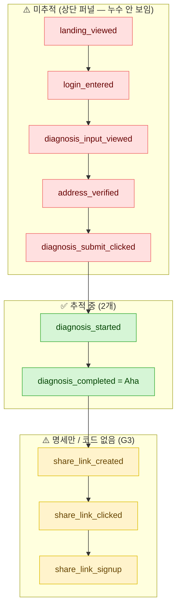

# OnDay MVP 핵심지표 측정계획 리포트 (AARRR · NSM)

> 서비스: **OnDay(온데이)** — 두 사람 출퇴근 동선 교집합 동네 진단기
> 기준 프로젝트: 로컬 `onday-app/` (Next.js 15) · 라이브 `onday-design-project.vercel.app`
> 근거 문서: `docs/00_PRD_v1.1-rev.4.md` · `docs/05_SRS_v1.7.md` · 실제 코드(`src/…`, file:line 인용)
> 작성: CPO/데이터 전략가 관점 · 작성일 2026-06-21
>
> **⚠️ 가정/갭 목록 (본문에서 해당 위치에 재표기):**
> - **G1.** 결제(Revenue)는 MVP **Out of Scope**(PRD rev.4 §7-2) — 매출 단계는 WTP 설문으로 **대리 측정**.
> - **G2.** 상단 퍼널(랜딩~주소검증) 이벤트는 **현재 미추적** — 코드상 추적 이벤트는 `diagnosis_started`·`diagnosis_completed` **2개뿐**(`src/lib/analytics/mixpanel.ts:33,41`).
> - **G3.** SRS가 정의한 보조 KPI 이벤트(`share_link_clicked`·`share_link_signup`·`survey_wtp_completed`·`session_start` 등, `docs/05_SRS_v1.7.md:577-585`)는 **명세만 존재 / 추적 코드 없음**(grep 결과 0건).
> - **G4.** **Admin 대시보드 화면 없음** — `src/app` 내 admin 라우트 부재(검색 0건). 운영자 도구 씨앗은 `/playboard/logging-test`(dev 전용) 뿐.
> - **G5.** NPS·D+7 리텐션·긴급이사 계약완료율은 **인앱/외부 설문·코호트 분석 의존** — 단발 로그로 환원 불가, 측정 파이프라인 미구축.

---

## 1. 북극성 지표(NSM) 제안



### 1-1. 기존 NSM 검증 — "주간 진단 완료 수"

OnDay는 이미 PRD §1-4와 `docs/05_SRS_v1.7.md:577`(REQ-NF-026)에서 북극성 지표를 **"진단 완료 수 / 주"** (기준선 0 → 50건/주 3개월 → 200건/주 6개월, Amplitude `diagnosis_completed` count)로 정의했다. 이 지표를 NSM 선정 4기준으로 검증하면:

| 기준 | 평가 | 근거 |
|------|------|------|
| 고객 가치 직결 | ✅ 강함 | OnDay의 핵심 가치 = "두 동선 교차 좋은 동네를 찾았다"는 경험. **진단 완료 = 그 가치 1회 전달**(JTBD 14명 전원 "두 동선 교차" 언급, PRD §9-0). |
| 실행·측정 가능 | ✅ 이미 구현 | `diagnosis_completed` 이벤트가 결과 화면 진입 시 발화(`src/app/diagnosis/result/[id]/result-view.tsx:73`). |
| 단순·명확 | ✅ 높음 | "한 주에 몇 명이 진단을 끝냈나" — 팀 누구나 이해. |
| 기존 데이터 도출 | ⚠️ 부분 | 베타 초기라 과거 성장 패턴 축적 전. **선행 지표로 인과 보강 필요**. |

**결론: 기존 NSM은 타당하다.** 다만 "완료 수"만 보면 **상단 퍼널 누수(왜 완료까지 못 갔나)를 못 본다** — 그래서 아래 후보 비교로 선행 지표 인과 구조를 보강한다.

### 1-2. NSM 후보 3가지

#### 후보 A — 🌟 주간 진단 완료 수 (`diagnosis_completed` / 주) — **기존 정의**
- **선택 논리:** 핵심 가치 1회 전달의 직접 카운트. 이미 추적 중이라 즉시 측정 가능. MVP 북극성으로 가장 단순·명확.
- **선행 지표 3:**
  1. **주소 2건 입력 완료율** = 진단 입력 화면 진입 → 주소 A·B 검증 통과 비율 (Activation 직전 관문)
  2. **진단 제출 성공률** = 제출 클릭 → `diagnosis_started` 발화 비율 (커버리지·API 실패 누수 감지, `src/app/diagnosis/page.tsx:202`)
  3. **재방문 진단율** = 저장 조건 불러오기(`SAVED_SEARCH`) 또는 D+7 재진단 비율
- **한계:** "완료"가 1회성이라 **재방문·확산(부부 합의)** 가치는 약하게 반영.

#### 후보 B — 주간 "공유까지 도달한 진단 수" (`share_link_created` / 주)
- **선택 논리:** OnDay의 진짜 JOB은 *"배우자와 합의"* — 단독 진단보다 **공유 링크 생성**이 부부 의사결정 가치에 더 근접(배우자 공유 링크 12/14명 언급, PRD §9-0; 보조 KPI 공유 클릭률 ≥40%, AGENTS §1). 자연 바이럴 루프의 입구.
- **선행 지표 3:** ① 진단 완료 수(상위 후보 A가 선행이 됨) ② 결과 화면 체류·후보 카드 상세 열람률 ③ 공유 버튼 노출 대비 클릭률
- **한계:** 싱글 모드(A-01 이준혁) 사용자는 공유 동기가 약해 **세그먼트 편향**. 아직 `share_link_created` 이벤트 **미추적**(G3).

#### 후보 C — 주간 활성 진단 사용자 수 (WAU, distinct user with `diagnosis_completed`)
- **선택 논리:** "건수"가 아닌 "사람 수"라 봇·중복 진단에 덜 휘둘리고 성장의 폭(reach)을 봄.
- **선행 지표 3:** ① 신규 가입·게스트 진입 수 ② 1인당 평균 진단 횟수 ③ D+7 재방문율(REQ-NF-030)
- **한계:** 게스트 진단은 세션 종료 시 데이터 자동 삭제(랜딩 카피 명시, `landing-client.tsx:179`)라 **distinct user 식별이 익명 단위로 제한** → 정확한 WAU 산출에 보완 필요.

### 1-3. 최종 추천 NSM

> **🌟 최종 추천: "주간 진단 완료 수"(후보 A) 유지 — 단, 선행 지표를 "주소 2건 입력 완료율 · 진단 제출 성공률 · 공유 링크 생성률" 3종으로 고정한다.**

- **이유(간결성):** 베타 단계에서 지표를 갈아엎으면 비교 가능성이 깨진다. 기존 NSM이 타당하므로 **유지하되, 후보 B의 핵심(공유=부부 합의 가치)을 선행 지표로 흡수**해 인과를 보강한다.
- **인과 구조(선행↑ ⇒ NSM↑):** 입력 완료율↑ → 제출 성공률↑ → **진단 완료 수↑**, 그리고 공유 생성률↑ → 2nd 유저 유입↑ → 다음 주 진단 완료 수↑ (바이럴 되먹임).
- 후보 B·C는 **GA 단계 NSM 승격 후보**로 보류(현재 미추적·세그먼트 편향).

---

## 2. AARRR 퍼널 분석


### 2-1. 일반 관점 AARRR

| 단계 | OnDay에서의 의미 | 대표 측정 질문 |
|------|------------------|----------------|
| **Acquisition** | 랜딩페이지(`/landing`)로 유입 | 어떤 채널로 랜딩에 들어오나 |
| **Activation** | **진단 완료 = Aha moment** ("우리 동네 후보가 나왔다") | 유입 중 몇 %가 진단을 끝내나 |
| **Retention** | 저장 조건 재진단·데드라인 모드 재방문 | 며칠 뒤 다시 오나 |
| **Revenue** | ⚠️ **MVP 결제 제외(G1)** → WTP 설문 응답이 대리 | 얼마 낼 의향이 있나 |
| **Referral** | **배우자에게 공유 링크 전송 → 2nd 유저 진단** | 한 진단이 몇 명을 더 데려오나 |

### 2-2. OnDay 타겟·CJM 기반 퍼널 (실제 화면 흐름)

실제 라우트(`src/app/`) 기준 사용자 여정:

```
/landing  →  /login (게스트 or 카카오/네이버)  →  /diagnosis (주소 A·B + 필터 입력)
   →  [제출]  →  /diagnosis/result/[id] (부부) | /single/[id] (싱글)
   →  /share/[uuid] (배우자 공유)  ·  /deadline (긴급 이사)  ·  저장(/api/save)
```

세그먼트별 퍼널 특성(PRD §2-2):

| 세그먼트 | 핵심 JOB | 퍼널 강조점 |
|----------|----------|-------------|
| **C-01 맞벌이 부부**(WTP 3~5만) | 두 동선 교차 + 배우자 합의 | Referral(공유)이 핵심 — 부부 2인 합의가 가치 |
| **C-03 긴급 이사**(WTP **10만**) | 데드라인 급매 | Activation 속도 + `/deadline` 재방문(Retention) |
| **C-04 반복 이사**(WTP 3만) | 입력값 저장·재탐색 | Retention(저장→재진단)이 핵심 |
| **A-01 이직 후 이사** | 싱글 모드 간소화 | 단독 완료 — Referral 동기 약함 |

### 2-3. [감지 가능 / 불가능 데이터 구분 — 핵심 갭]

> **현재 코드가 실제로 남기는 이벤트는 단 2개다.** (`src/lib/analytics/mixpanel.ts`)
> `diagnosis_started`(제출 성공 시, `page.tsx:202`) · `diagnosis_completed`(결과 화면 진입, `result-view.tsx:73`).
> 둘 다 **제출 이후** 시점이라 **그 앞 단계 전부가 깜깜이**다(G2).



| 퍼널 구간 | 감지 가능? | 현황 |
|-----------|-----------|------|
| 랜딩 유입 → 로그인 → 입력 → 주소검증 → 제출클릭 | ❌ **불가** | 이벤트 미배선(G2) |
| 제출 성공(started) → 완료(completed) | ✅ 가능 | Mixpanel 추적 중 |
| 공유 생성 → 클릭 → 2nd 가입 | ❌ **불가** | SRS 명세만, 코드 0건(G3) |
| 결제(Revenue) | — | **Out of Scope**(G1) |

**보완 방안 (1) — 데이터 수집 보강:** 상단 퍼널 5개 이벤트(`landing_viewed`·`login_entered`·`diagnosis_input_viewed`·`address_verified`·`diagnosis_submit_clicked`)를 배선한다 → **Section 3에서 스키마 확정**.

**보완 방안 (2) — 우회 측정 (배선 전 임시):**
- **상단 전환율 대리:** Vercel Analytics 페이지뷰(`/landing`·`/login`·`/diagnosis`)로 화면 단위 통과율을 **근사**한다(클릭 단위 정밀도는 없음).
- **에러 누수 감지:** 화요일 구축한 **`error_logs` 3-sink**(`src/lib/logging/log-error.ts`, 6개 API 라우트 배선 — PR #238·#239)로 제출 단계 실패(API 500/502)를 **이미 포착 중**. "왜 완료까지 못 갔나"의 일부(서버 에러)는 이 로그로 우회 측정 가능.
- **공유 클릭 대리:** `/share/[uuid]` 라우트 접근(Vercel Analytics)으로 클릭률 근사.

---

## 3. 데이터 수집 플랜 (로그 감지 계획)

### 3-1. 이벤트 스키마 표 (완비 / 보완)

> **구현 현황 (본 리포트 작성 후 배선 반영):** 보완 10개 중 **9개 배선 완료** — 상단 퍼널 5종(#241) + Referral·Retention 4종(#242). 미배선은 `share_link_signup` 1개(attribution 갭, 후속 과제). 속성은 실제 `onday-app/src/lib/analytics/mixpanel.ts` 기준(PII 제외분 정정). 기존 2종(`diagnosis_started`·`diagnosis_completed`)·`app_error`는 그 이전 완비.

| event_name | 발생 화면 | 트리거(행동) | 핵심 properties | AARRR | NSM/Input | 상태 |
|------------|----------|--------------|-----------------|-------|-----------|------|
| `diagnosis_started` | `/diagnosis` | 제출 성공(diagnosisId 발급) | `diagnosis_id`, `timestamp` | Activation | 제출 성공률(Input2) | ✅ **완비** (`page.tsx:202`) |
| `diagnosis_completed` | `/diagnosis/result/[id]` | 결과 화면 진입 | `diagnosis_id`, `timestamp` | Activation(Aha) | 🌟 **NSM** | ✅ **완비** (`result-view.tsx:73`) |
| `landing_viewed` | `/landing` | 랜딩 최초 노출 | `timestamp` | Acquisition | 유입 수 | ✅ **완비** (#241, `landing-client.tsx`) |
| `login_entered` | `/login` | 로그인/게스트/심사관 진입 | `method`(kakao/guest/reviewer) | Acquisition→Activation | 유입→활성 | ✅ **완비** (#241, `login-form.tsx`) |
| `diagnosis_input_viewed` | `/diagnosis` | 입력 화면 진입 | `mode`(couple/single) | Activation | 입력 완료율(Input1) 분모 | ✅ **완비** (#241, `diagnosis/page.tsx`) |
| `address_verified` | `/diagnosis` | 주소 A·B 커버리지 검증 통과 | `count`(1/2) | Activation | 입력 완료율(Input1) 분자 | ✅ **완비** (#241, `count`만 — 주소·좌표 PII 제외) |
| `diagnosis_submit_clicked` | `/diagnosis` | 제출 버튼 클릭(성공 전) | `mode` | Activation | 제출 성공률 분모 | ✅ **완비** (#241, `has_deadline` 미포함 — /diagnosis에 deadline 입력 없음) |
| `share_link_created` | `/diagnosis/result/[id]` | 공유 링크 생성(`/api/share`) | `diagnosis_id`, `mode` | Referral | 공유 생성률(Input3) | ✅ **완비** (#242, 부부·싱글 handleShare) |
| `share_link_clicked` | `/share/[uuid]` | 공유 링크 수신자 진입(클라뷰) | `mode` | Referral | 보조 KPI(REQ-NF-028) | ✅ **완비** (#242, `uuid` 미포함 — 공유 토큰 PII 제외) |
| `share_link_signup` | `/login` | 공유 경유 2nd 유저 가입 | `method`, `via_share`(제안) | Referral | 보조 KPI(REQ-NF-029) | ⚠️ **미배선**(G3 — attribution 연결 없음, 후속 과제) |
| `saved_search_loaded` | `/diagnosis` | "이전 조건 불러오기" | `mode` | Retention | 재진단율 | ✅ **완비** (#242, handleLoadLast 성공 시) |
| `deadline_mode_activated` | `/deadline` | 데드라인 저장(활성화) | `days_left` | Retention | REQ-NF-032 | ✅ **완비** (#242, handleSave 성공 시) |
| `app_error`(서버) | 6개 API 라우트 | catch 블록 진입 | `route`,`statusCode`,`errorType`,`userType`,`visitorId` | (운영) | 퍼널 누수(에러) | ✅ **완비** (`error_logs`, PR #238·#239) |

> **측정 가능성 환원 적용:** "사용자가 적극적이다" → `7일 내 diagnosis_completed 3회+`; "부부가 합의했다" → `share_link_clicked AND 2nd diagnosis_completed`; "동네가 마음에 들었다" → `후보 카드 detail_sheet 열람 + 저장`.

#### 1) 데이터 수집 준비 완비
- **`diagnosis_started` / `diagnosis_completed`** — 화면 진입·제출 성공 시 발화, properties는 `diagnosis_id`+`timestamp`만(이메일/주소 **미포함**, `ip:false` 익명화 — `mixpanel.ts:10`). 토큰 미설정 시 no-op(런타임 안전).
- **`app_error`(error_logs 3-sink)** — 콘솔+DB(`error_logs` 테이블)+Sentry. PII 마스킹(`maskPII`) 거침, USER FK 없음(익명 `visitorId`만). 6개 핵심 API 배선 완료.

#### 2) 데이터 수집 보완 필요
- **상단 퍼널 5종**(`landing_viewed`~`diagnosis_submit_clicked`) — **신설**. 클라이언트 컴포넌트 마운트/버튼 onClick에 `mixpanel.track()` 추가. **이것이 G2 핵심 갭 해소**이자 NSM 선행 지표(입력 완료율·제출 성공률)의 분모/분자 공급원.
- **Referral 3종**(`share_link_*`) — `/api/share` 성공 콜백 + `/share/[uuid]` 진입 + 공유 경유 가입에 배선. SRS REQ-NF-028·029 충족(현재 명세만, G3).
- **Retention 2종**(`saved_search_loaded`·`deadline_mode_activated`) — 재방문 가치 측정.

### 3-2. 집계·지표화 방식 (관리방침 + 집계 수식)

| 지표 | 집계 수식 | 집계 주기 | distinct 기준 | 관리방침/비고 |
|------|----------|----------|---------------|---------------|
| 🌟 **주간 진단 완료 수** | `COUNT(diagnosis_completed)` | 주(월~일) | 이벤트 단위 | 봇/내부 IP 제외, `diagnosis_id` 중복 제거. 목표 50→200(REQ-NF-026) |
| **주소 2건 입력 완료율** | `distinct(address_verified.count=2) ÷ distinct(diagnosis_input_viewed) × 100` | 주 | 익명 `visitor_id` | 싱글 모드는 count=1 기준 분리 |
| **진단 제출 성공률** | `COUNT(diagnosis_started) ÷ COUNT(diagnosis_submit_clicked) × 100` | 주 | 이벤트 | 100%−성공률 = **제출 누수**. `error_logs`의 `POST /api/diagnosis` 건수와 교차검증 |
| **공유 링크 생성률** | `COUNT(share_link_created) ÷ COUNT(diagnosis_completed) × 100` | 주 | 이벤트 | 부부 합의 가치 대리. 세그먼트(couple/single) 분리 |
| **공유 클릭률**(REQ-NF-028) | `COUNT(share_link_clicked) ÷ COUNT(share_link_created) × 100` | 주 | `uuid` | 목표 ≥40% |
| **2nd 유저 전환율**(REQ-NF-029) | `COUNT(share_link_signup) ÷ COUNT(share_link_clicked) × 100` | 주 | 익명→user_id | 목표 ≥15% |
| **D+7 리텐션**(REQ-NF-030) | `(가입 후 7일째 session 발생 user) ÷ (해당 코호트 가입자) × 100` | 월·코호트 | `user_id` | ⚠️ 코호트 파이프라인 미구축(G5). 목표 ≥25% |
| **에러율**(운영) | `COUNT(error_logs WHERE statusCode≥500) ÷ COUNT(diagnosis_started) × 100` | 일 | 이벤트 | 화요일 구축 자산 직접 활용. 급증 시 퍼널 누수 경보 |

**공통 관리방침:** ① 봇·내부 트래픽 제외(내부 IP·UA 필터) ② distinct는 로그인 유저=`user_id`, 게스트=익명 `visitor_id`(localStorage 30일 TTL, `src/lib/logging/visitor-id.ts`) ③ PII 미수집 원칙 유지(`ip:false`, `maskPII`) ④ 데이터 보존: 이벤트 무기한(집계), `error_logs` 30일 권장.

### 3-3. [optional] Admin 대시보드 구성 계획 (설계안 — 구현 아님)

> **⚠️ 현황 정직 표기(G4):** OnDay에 **Admin 대시보드 화면은 없다**(`src/app` 내 admin 라우트 0건). 다만 화요일 구축한 **`/playboard/logging-test`**(dev 전용, production 차단)가 **운영자 도구의 씨앗**이다 — 같은 패턴(production 차단 + 운영자 전용 + registry 참조)으로 확장 가능.

**제안 대시보드 구성 (지표 성격별 시각화):**

| 패널 | 시각화 | 데이터 소스 |
|------|--------|-------------|
| 북극성 추세 | 주간 라인 차트(진단 완료 수 vs 목표선 50/200) | Mixpanel `diagnosis_completed` |
| 전환 퍼널 | 5단계 퍼널 바(landing→completed) | 상단 퍼널 신설 이벤트 |
| 바이럴 루프 | Sankey(진단→공유→2nd 가입) | `share_link_*` |
| 리텐션 | 코호트 히트맵(D0~D30) | `session_start` 코호트 |
| 운영 헬스 | 에러율 추세 + 라우트별 분포 | **`error_logs` 테이블 직접 쿼리** |

**구현 계획:** ① 데이터 소스 = Mixpanel(퍼널) + Supabase `error_logs`(운영) ② 집계 파이프라인 = 초기엔 Mixpanel 대시보드 + Supabase SQL 뷰로 충분(별도 ETL 불필요) ③ 갱신 주기 = 퍼널 일/주, 에러 실시간 ④ 기술 스택 = `/playboard/logging-test` 패턴 재사용(Next.js RSC + `getDeploymentEnv()` production 차단), 차트는 단순 SVG/Recharts. **MVP 단계에선 Mixpanel 기본 대시보드로 시작하고, error_logs 패널만 자체 구축**을 권장(간결성).

---

### ✅ 보고서 검토 기준 (Final Output Checklist)
- **[검토 1] 측정 가능성** — 모든 지표를 로그 가능 행동으로 환원(예: "부부 합의"→`share_link_clicked AND 2nd diagnosis_completed`). ✅
- **[검토 2] 인과 관계** — 입력 완료율↑→제출 성공률↑→**진단 완료 수↑**, 공유 생성률↑→2nd 유입↑→차주 완료수↑. ✅
- **[검토 3] 간결성** — NSM 1개 유지 + 선행 3개로 고정, 신설 이벤트는 상단 퍼널 5종에 집중(나머지 후순위). ✅
