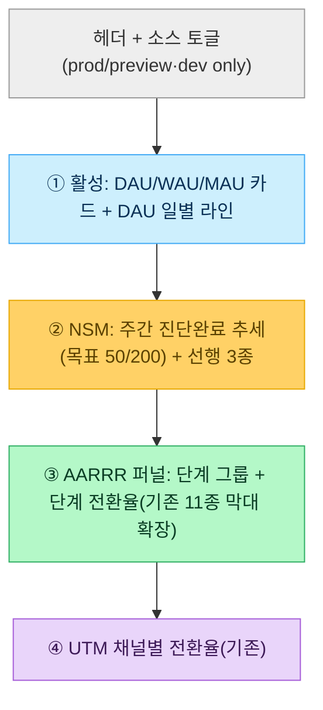

# OnDay 전환관리 대시보드 확장 계획서 (#251 /playboard/insights 발전)

> 목표: 머지된 `#251 /playboard/insights`(11종 퍼널 + 전환율 3종 + UTM)를 **전환관리 대시보드**로 확장 — **DAU/WAU/MAU** + **AARRR 퍼널 단계별 전환율** + **NSM(주간 진단 완료) + 선행 지표 3종**.
> ★ 이 문서는 **계획서**다. 구현 0. 발표 일주일 — additive·prod 차단·읽기 전용 유지.
> 근거(실코드): `src/lib/playboard/insights.ts`·`src/app/playboard/insights/page.tsx`·`prisma/schema.prisma`(EventLog: `visitorId` 익명·`timestamp` 인덱스). 지표 정의: `AARRR_NSM_PROPOSAL.md`·`LOG_IMPLEMENTATION_OUTLINE.md`.

---

## 0. 현황 → 확장 (정직)

| | #251 현재 | 본 계획 확장 |
|---|----------|--------------|
| 지표 | 11종 퍼널 카운트 · 전환율 3종 · UTM 채널 | **+ DAU/WAU/MAU · + AARRR 단계 전환율 · + NSM 주간 추세** |
| 데이터원 | `event_logs`(prod, 48행) 고정 | **소스 토글**(prod 실데이터 ↔ preview 더미 350행) |
| 집계 | raw 직접(크론 0) | 동일 — raw 직접 유지 |
| 안전 | prod 차단·읽기전용·additive | 동일 |

**★ 핵심 설계 결정 — 데이터 소스 토글:** 현재 대시보드는 `prisma.eventLog`(prod)만 읽어, Step 1에서 만든 **preview 더미 350행이 화면에 안 보인다**. 발표 데모를 위해 **dev/preview 한정 소스 토글**을 둔다(아래 §4). prod 적재·운영 지표는 그대로 `event_logs`, 데모는 `preview_event_logs`.

---

## 1. 모니터링 지표 ① — DAU/WAU/MAU (서비스 활성)

**정의 (익명 `visitorId` distinct 기준 — PII 0):**
| 지표 | 정의 | 비고 |
|------|------|------|
| DAU | 해당 **일(UTC day)**에 1건 이상 이벤트를 남긴 distinct `visitorId` | 일별 추세 라인 |
| WAU | 최근 **7일 trailing** distinct `visitorId` | rolling |
| MAU | 최근 **30일 trailing** distinct `visitorId` | rolling |
| Stickiness | DAU ÷ MAU × 100 | 재방문 밀도(선택) |

**산출 방식 (raw 직접, 크론 0):**
```ts
// getActivity(): event_logs 에서 (visitorId, timestamp) 만 select → JS 집계
//   - DAU: day → Set<visitorId>.size (최근 N일 배열)
//   - WAU/MAU: 오늘 기준 trailing window 의 Set<visitorId>.size
```
- `visitorId` null(시크릿/차단) 행은 distinct 제외(분모 주의 — §6 갭).
- 소량(수백~수천 행)이라 단일 `findMany({select:{visitorId,timestamp}})` + JS 충분.

---

## 2. 모니터링 지표 ② — AARRR 퍼널 단계별 전환율

**11종 → AARRR 단계 매핑 (LOG_IMPLEMENTATION_OUTLINE §2 계승):**
| 단계 | 이벤트 | 단계 전환율(예) |
|------|--------|----------------|
| **Acquisition** | landing_viewed · login_entered | login ÷ landing |
| **Activation** | diagnosis_input_viewed → address_verified(2) → submit_clicked → started → **completed(Aha)** | completed ÷ input |
| **Referral** | share_link_created · share_link_clicked | created ÷ completed · clicked ÷ created |
| **Retention** | saved_search_loaded · deadline_mode_activated | (재방문) |

- 기존 #251 퍼널 막대 위에 **단계 경계(Acquisition/Activation/Referral/Retention) 그룹 헤더 + 단계 전환율** 추가.
- 핵심 전환율 3종(이미 구현)은 Activation/Referral의 대표 지표로 재배치.

---

## 3. 모니터링 지표 ③ — NSM + 선행 지표 3종

- **🌟 NSM = 주간 진단 완료 수** = `COUNT(diagnosis_completed)` per ISO week. 목표선 50→200(REQ-NF-026, `AARRR_NSM_PROPOSAL §1-1`) 오버레이.
- **주간 추세** = 최근 8~12주 라인(주별 버킷, `timestamp` group).
- **선행 지표 3종(이미 구현, 재노출):** 주소 2건 입력 완료율 · 진단 제출 성공률 · 공유 링크 생성률(AARRR §3-2 수식).
- NSM 추세는 distinct 아님(이벤트 카운트) — 완료는 `diagnosisId` 기준 중복 제거 권장(§6 갭).

---

## 4. ★ 데이터 소스 토글 설계 (preview 더미 데모)

**문제:** 대시보드가 `event_logs`(prod)만 읽음 → preview 더미 350행 비가시.

**설계 (dev/preview 한정, prod 영향 0):**
- `getInsights(source: "prod" | "preview")` + 신규 `getActivity(source)` — `source==="preview"`면 `prisma.previewEventLog`, 아니면 `prisma.eventLog`.
- 페이지는 **production 만 차단**(`getDeploymentEnv()==="production" → notFound`). ⚠️ **정직 표기: `preview` 배포는 차단 안 됨** — Vercel preview URL에서는 렌더+토글이 동작하고 `robots noindex`만 걸린다(접근 차단 아님). "운영(production) 노출 0"은 맞으나 "preview 노출 0"은 **아니다**. preview도 막으려면 차단을 `!== "development"`로 넓히는 별도 결정 필요(§6 갭).
- UI: `?source=preview` 쿼리(또는 상단 탭) → dev/preview에서 더미로 데모, 기본은 `prod`.
- **안전:** 읽기 전용(SELECT). preview/prod 양쪽 다 write 0. 토글은 **읽는 테이블만** 바꿈.

```
/playboard/insights            → prod event_logs (실 48행)
/playboard/insights?source=preview → preview_event_logs (더미 350행, 데모)
```

---

## 5. #251 확장 — 화면 구성(안)


- 추가 데이터 함수: `getActivity()`(DAU/WAU/MAU), `getNsmTrend()`(주간). 기존 `getInsights()`는 `source` 인자만 추가(시그니처 확장, 호출부 기본값 유지 → 회귀 0).
- 렌더: 기존 RSC 단일 페이지에 섹션 추가. 차트는 단순 CSS 막대/라인(외부 차트 lib 0, 의존성 추가 없음).

---

## 6. 미구현 갭 (정직)

| 항목 | 상태 |
|------|------|
| distinct 정규화·봇 제외 | ⚠️ DAU/WAU/MAU는 visitorId distinct지만, 퍼널/NSM은 이벤트 카운트(완료는 diagnosisId 중복제거 권장) → [distinct-normalization](issues/distinct-normalization.md) |
| visitorId null 처리 | ⚠️ 시크릿/차단 시 null → distinct 제외(과소 집계 가능), 화면 주석 표기 |
| **preview 배포 노출** | ⚠️ `notFound`는 production만 차단 → **preview URL에서 대시보드 렌더됨**(noindex만). 운영(prod) 노출 0은 맞으나 preview 접근차단 아님. preview까지 막으려면 차단 조건 `!== "development"` 확장 별도 결정 |
| NSM 완료 distinct | ⚠️ `diagnosisId` 기준 중복제거 권장이나 **nullable·FK 없음** → null 행은 dedup 누수 → null이면 행 카운트 폴백 |
| 가집계/최종집계 크론 | ❌ 미구현 — raw 직접으로 충분한 규모 전제 → [cron-aggregation](issues/cron-aggregation.md) |
| NSM 목표선 데이터 | 50/200은 상수(REQ-NF-026), 실측 추세와 병치 |
| 표본 | 더미 350행/prod 48행 — 구조 검증용, 통계 신뢰는 데이터 축적 후 |

---

## 7. 구현 로드맵 (승인 후 — additive 단계)

| 단계 | 내용 | 위험 |
|------|------|------|
| E1 | `getActivity()`(DAU/WAU/MAU) + 카드/라인 섹션 | 🟢 읽기전용·추가만 |
| E2 | 소스 토글(`source` 인자 + `?source=preview`) | 🟢 dev 한정·prod 차단 안 |
| E3 | NSM 주간 추세 + AARRR 단계 그룹 헤더 | 🟢 기존 퍼널 위 추가 |
| (E4) | distinct 정규화 | 🟡 후속 이슈 |

- 전 단계 회귀 0: 신규 함수·섹션 추가, `getInsights()` 시그니처는 기본값으로 하위호환, 마이그레이션 0, prod 차단·읽기전용 유지.

---

*근거: 실코드 `insights.ts`·`page.tsx`·`schema.prisma`(EventLog visitorId/timestamp). 더미 350행(preview, Step 1). 지표 정의 AARRR_NSM_PROPOSAL·LOG_IMPLEMENTATION_OUTLINE.*
