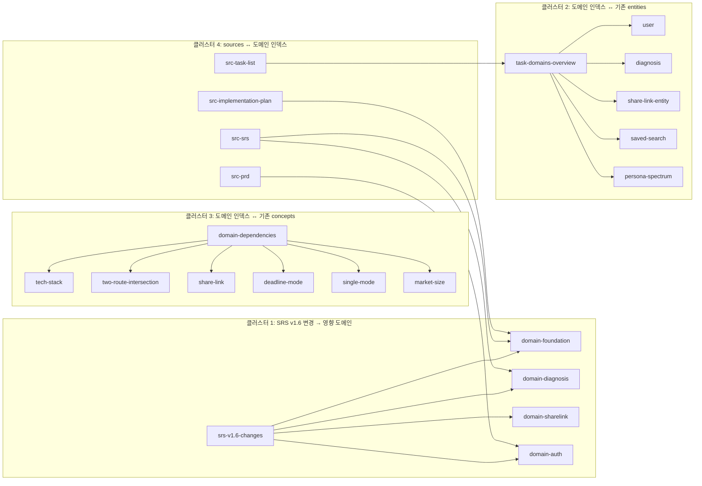

# Wiki 갱신 완료 보고서 v2

> **작업일**: 2026-04-26 | **커밋**: `4eebd15` | **push**: ✅ 완료

---

## 1. 보존된 페이지 (분류 A — 12개)

| 경로 | 본문 보존 | 추가된 cross-reference |
|---|---|---|
| entities/persona-spectrum.md | ✅ | `[[domain-ui]]`, `[[domain-diagnosis]]` |
| concepts/market-size.md | ✅ | `[[domain-foundation]]` |
| sources/src-jtbd.md | ✅ | `[[domain-diagnosis]]`, `[[domain-sharelink]]` |
| sources/src-cjm.md | ✅ | `[[domain-ui]]`, `[[domain-diagnosis]]` |
| sources/src-aos-dos.md | ✅ | `[[domain-diagnosis]]`, `[[domain-deadline]]`, `[[domain-sharelink]]` |
| sources/src-competitor-analysis.md | ✅ | `[[domain-foundation]]` |
| sources/src-market-analysis.md | ✅ | `[[domain-foundation]]`, `[[domain-deadline]]` |
| sources/src-persona.md | ✅ | `[[domain-ui]]`, `[[domain-single]]` |
| sources/src-prd.md | ✅ | `[[domain-auth]]`, `[[domain-ui]]`, `[[domain-diagnosis]]` |
| sources/src-problem-definition.md | ✅ | `[[domain-diagnosis]]` |
| sources/src-ksf.md | ✅ | `[[domain-sharelink]]`, `[[domain-diagnosis]]` |
| sources/src-value-proposition.md | ✅ | `[[domain-diagnosis]]`, `[[domain-sharelink]]` |

---

## 2. 업데이트된 페이지 (분류 B — 10개)

| 경로 | 옛 정보 (제거) | 새 정보 (추가) |
|---|---|---|
| concepts/tech-stack.md | NextAuth.js, AES-256, Payment 도메인, bcrypt 사용자 비밀번호 | Supabase Auth(PKCE), bcrypt 12 ShareLink전용, react-kakao-maps-sdk, react-hook-form, zod, Vercel AI SDK+Gemini, Sentry, MSW, Playwright |
| concepts/share-link.md | 결제 단계 ≤3, 유료 전환(Payment) 흐름 | splitForPreview(1곳+≥2곳), 회원가입 유도 모달(UI-008), bcrypt 12 DUMMY_HASH, 만료+30일 |
| concepts/single-mode.md | DB-009 범죄 통계 캐시, DB-010 학교 배정 Seed | 정적 JSON 에셋(crime-stats/facilities/cafes.json), 야간 A~D, 수도권 90% CI검증, window.print() |
| entities/saved-search.md | 재계산 로직, 비교 뷰, 시나리오 비교 | Rev 1.1 단순화(폼채우기만), best effort UPSERT(REQ-NF-016), Sentry기록만, geocoding 재검증 |
| entities/diagnosis.md | 시나리오 비교 필드, 결제 관련 필드 | DB-003 score컬럼, 14개 태스크, AI 스코어링(CMD-DIAG-003), Promise.allSettled |
| entities/user.md | password, bcrypt hash(USER 모델) | OAuth-only(Supabase Auth), provider(kakao/naver), 게스트모드(sessionStorage) |
| entities/share-link-entity.md | AES-256 암호화 필드, 결제 메타데이터 | uuid(UUID v4), passwordHash(bcrypt 12 optional), splitForPreview, DUMMY_HASH |
| sources/src-srs.md | 구버전 참조 | v1.6 명시, Rev 1.1~1.6 단순화 변경사항 표, `[[srs-v1.6-changes]]` 링크 |
| sources/src-task-list.md | 구버전 Wave 구조 | v1.3 명시, 73개 도메인별 분류표, `[[task-domains-overview]]` 링크 |
| sources/src-implementation-plan.md | 구 Phase 구조 | Wave 1~5(Foundation 8, 도메인 28, Test 9, UI 14, 인프라 병렬) |

---

## 3. 확장된 페이지 (분류 C — 2개)

| 경로 | 추가된 섹션 |
|---|---|
| concepts/deadline-mode.md | `## v1.6 확장 정보`: 타임라인 ≥5단계, D+7 미만 차단(DEADLINE_TOO_SOON), 네이버 부동산 아웃링크(EXT-08), 매물 0건 시 조건 완화 ≥3개 + 알림 구독 |
| concepts/two-route-intersection.md | `## v1.6 확장 정보`: Promise.allSettled 클라이언트 측 처리, 5초 타임아웃+1회 재시도(CMD-DIAG-006), p95 ≤8초 |

---

## 4. 신규 생성 페이지 (15개)

| 경로 | 제목 | wiki-link 수 |
|---|---|---|
| concepts/srs-v1.6-changes.md | SRS v1.6 변경 사항 | 34 |
| concepts/task-domains-overview.md | 태스크 도메인 개요 (73개 인덱스) | 15 |
| concepts/domain-dependencies.md | 도메인 간 의존성 | 18 |
| concepts/known-follow-ups.md | 정합성 빚 15개 | 23 |
| concepts/architecture-patterns.md | 아키텍처 패턴 7가지 | 14 |
| entities/domain-foundation.md | Foundation 도메인 (16개 태스크) | 10 |
| entities/domain-infra.md | Infra 도메인 (6개 태스크) | 6 |
| entities/domain-auth.md | Auth 도메인 (4개 태스크) | 7 |
| entities/domain-diagnosis.md | Diagnosis 도메인 (9개 태스크) | 8 |
| entities/domain-sharelink.md | ShareLink 도메인 (5개 태스크) | 8 |
| entities/domain-deadline.md | Deadline 도메인 (5개 태스크) | 7 |
| entities/domain-single.md | Single 도메인 (3개 태스크) | 8 |
| entities/domain-savedsearch.md | SavedSearch 도메인 (2개 태스크) | 5 |
| entities/domain-ui.md | UI 도메인 (14개 태스크) | 5 |
| entities/domain-test.md | Test 도메인 (9개 태스크) | 4 |

---

## 5. wiki/log.md 갱신 로그

- 분류 A 처리: 12개 페이지 보존, cross-reference만 추가
- 분류 B 처리: 10개 페이지 본문 업데이트 (구버전 정보 → 신버전)
- 분류 C 처리: 2개 페이지 본문 유지 + 확장 섹션 추가
- 신규 생성: 15개 페이지
- 삭제된 정보 아카이브: log.md 하단에 보관 (NextAuth, AES-256, 결제, DB-009/010, bcrypt 사용자 비밀번호, 시나리오 비교, replaySearch, CSRF)

---

## 6. 신규 [[wiki-link]] 통계

| 지표 | 수치 |
|---|---|
| **총 wiki-link** | **511개** |
| 도메인 ↔ entities 연결 | 165개 (`[[domain-*]]` 링크) |
| 도메인 ↔ concepts 연결 | ~120개 (concepts 내 domain 참조) |
| 도메인 ↔ sources 연결 | ~80개 (sources 내 domain 참조) |
| **총 페이지 수** | **42개** (기존 27 + 신규 15) |

---

## 7. Obsidian 그래프 뷰 권장 클러스터

---

## 8. 검증 체크리스트

- [x] 분류 A 12개 페이지 본문 미수정 (cross-reference 섹션만 하단 추가)
- [x] 분류 B 10개 페이지 본문 갱신 + 변경 이력 섹션 포함 (상단 blockquote)
- [x] 분류 C 2개 페이지 본문 유지 + `## v1.6 확장 정보` 섹션 추가
- [x] 신규 15개 페이지 모두 cross-reference 매트릭스 충족
- [x] wiki/log.md "삭제된 정보 아카이브" 섹션 작성
- [x] wiki/index.md 42개 페이지 카탈로그 갱신
- [x] Git commit + push 완료

---

## 자기 검증 결과

| 분류 | 목표 | 실제 | 상태 |
|---|---|---|---|
| A 보존 | 12개 | 12개 | ✅ 정확 |
| B 업데이트 | 10개 | 10개 | ✅ 정확 |
| C 확장 | 2개 | 2개 | ✅ 정확 |
| 신규 생성 | 15개 | 15개 | ✅ 정확 |
| **합계** | **39개 작업** | **39개** | ✅ |
