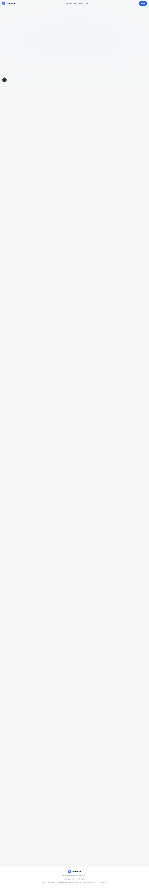
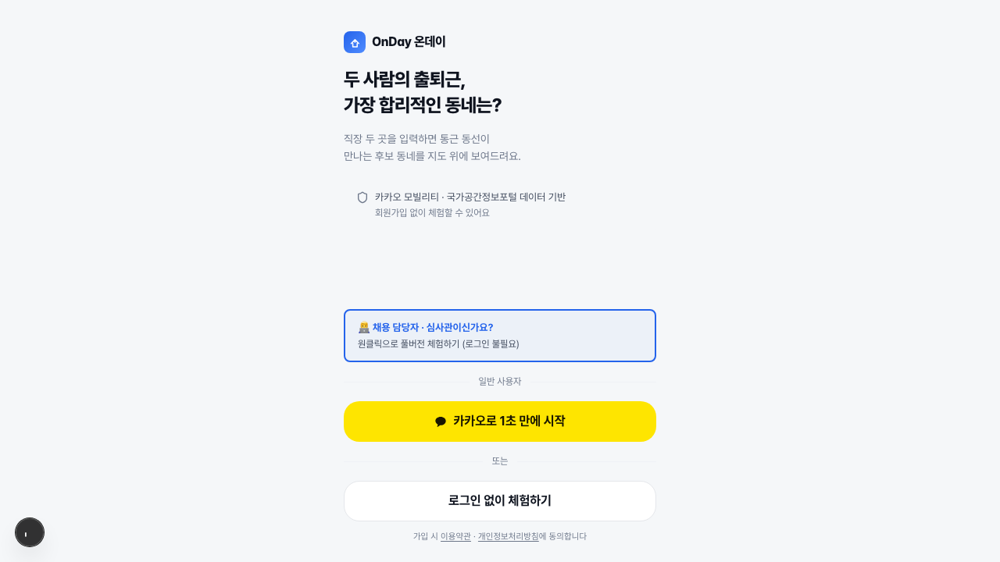
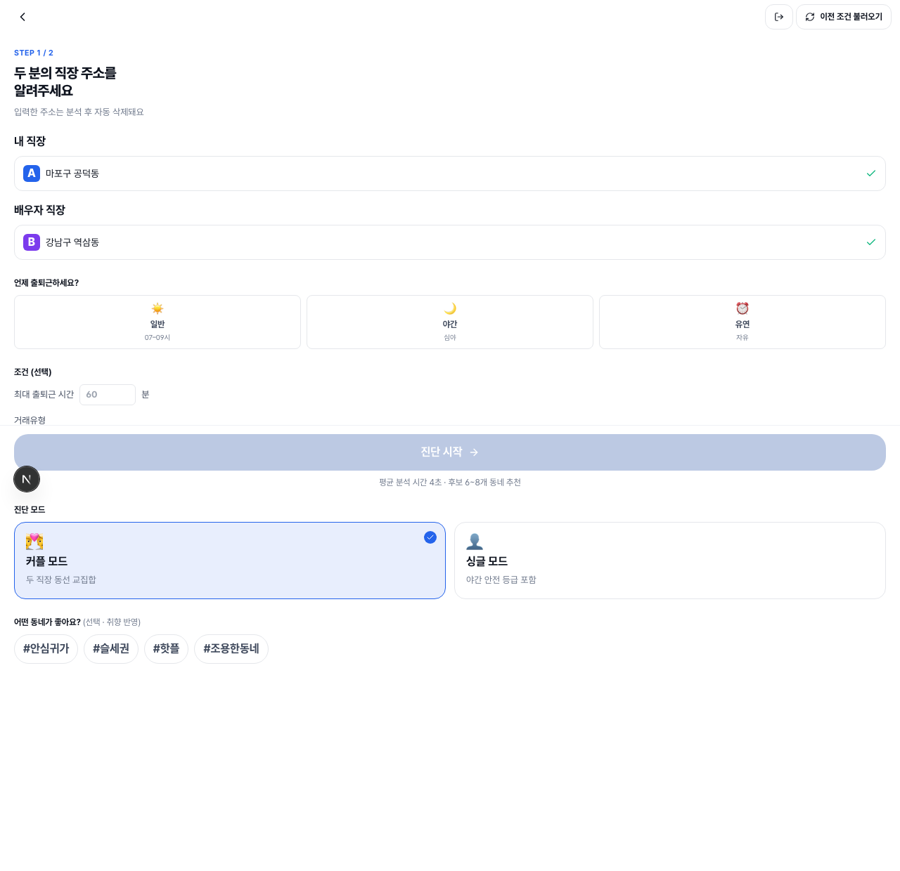
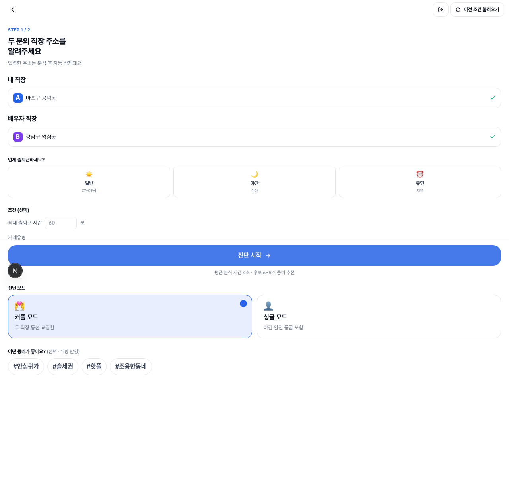
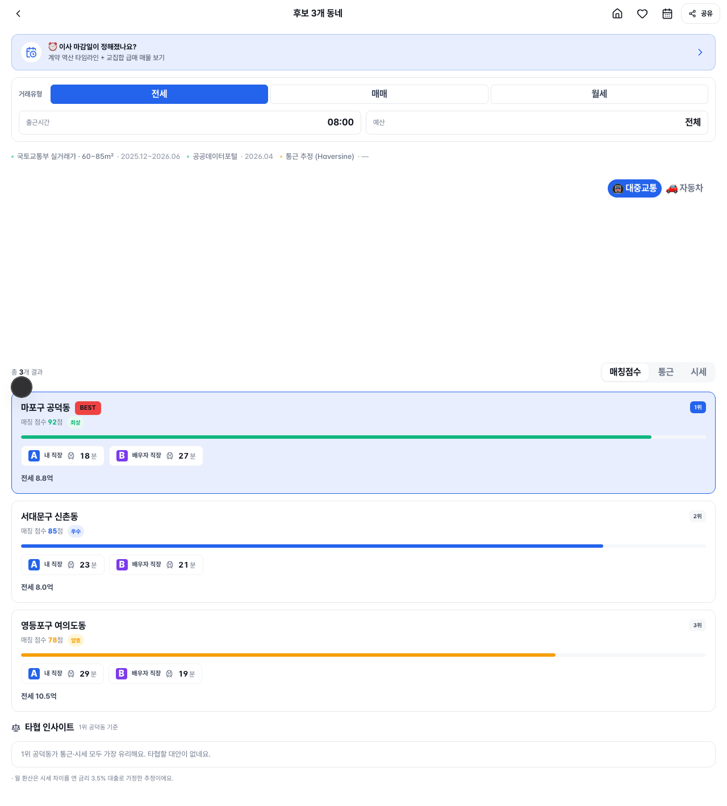

# OnDay Happy Path E2E — 시각 리포트

부부 모드 핵심 시나리오를 Playwright로 검증하고 단계별 스크린샷을 캡처한 리포트입니다.
**랜딩 → 로그인 → 두 직장 주소 입력 → 진단 → 추천 동네 결과**의 5단계 사용자 여정.

- 스펙: [`e2e/happy-path.spec.ts`](happy-path.spec.ts)
- 실행: `npm run e2e` (HTML 리포트: `npm run e2e:report`)
- 결과: ✅ **1 passed** (chromium)

## ★ DB 안전성 (테스트 격리)

- mock 모드(`NEXT_PUBLIC_USE_MOCK=true`)여도 `/api/diagnosis`는 실 클라우드 DB에 저장하므로,
  스펙이 `page.route('**/api/diagnosis')`로 **요청을 인터셉트**하여 fixture로 응답합니다.
- 요청이 서버에 닿지 않음 → `prisma.diagnosis.create` 미실행 → **실 `diagnoses` 테이블 쓰기 0**.
- 검증: fixture id `e2e-fixture-001`가 실 DB에 **존재하지 않음**(쓰기 0), 기존 351 rows 무변경.
- 외부 API(Kakao/ODsay)도 mock으로 호출 0.

---

## 단계별 스토리라인

### ① 랜딩 — 서비스 가치 노출
두 사람의 출퇴근 동선이 만나는 동네를 찾아준다는 핵심 가치를 노출. CTA로 로그인 진입.

### ② 로그인 — mock 원클릭
`NEXT_PUBLIC_USE_MOCK_AUTH=true` 환경에서 "카카오로 1초 만에 시작" 원클릭으로 즉시 진단 화면 진입(실 OAuth 불필요).

### ③ 두 직장 주소 입력 — 자동완성 선택
"내 직장"(공덕동)·"배우자 직장"(역삼동)을 입력하고 자동완성 제안을 선택 → 각 입력에 `verified`(그린 체크) 표시.

### ④ 진단 시작 — 버튼 활성
두 주소가 모두 확정되어 `canSubmit` 충족 → "진단 시작" 버튼 활성화.

### ⑤ 추천 동네 결과 — 후보 N개 + BEST 뱃지
진단 결과 페이지로 이동, "후보 N개 동네" 헤더와 최상위 후보의 **BEST** 뱃지가 표시됨.

---

## 셀렉터 노트 (data-testid 0개 → role/text 기반)

| 단계 | 셀렉터 |
| --- | --- |
| 로그인 진입 | `a[href="/login"]` |
| mock 로그인 | `getByRole('button', { name: '카카오로 1초 만에 시작' })` |
| 주소 입력 | `getByLabel('내 직장')` / `getByLabel('배우자 직장')` |
| 자동완성 선택 | `getByRole('option', { name: /공덕동/ })` (debounce 300ms → auto-wait) |
| 진단 시작 | `getByRole('button', { name: '진단 시작' })` |
| 결과 검증 | `getByText(/후보 \d+개 동네/)` + `getByText('BEST')` |
