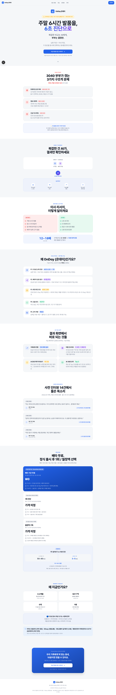
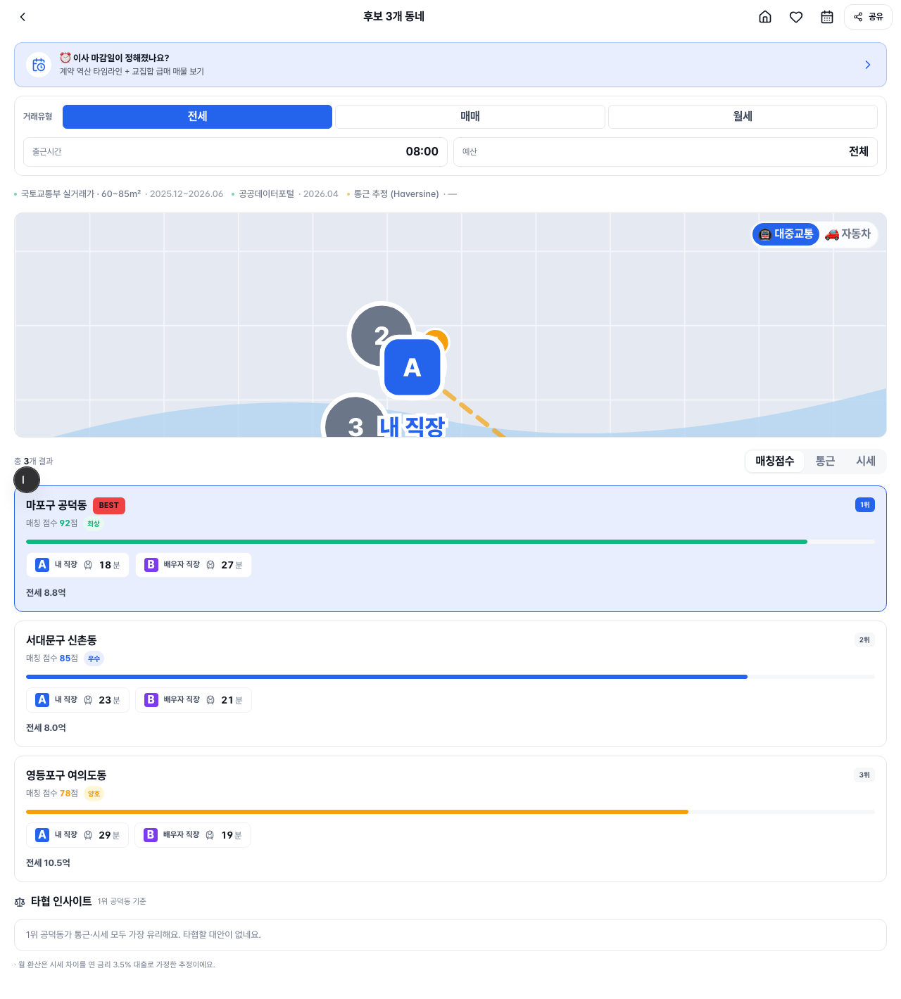
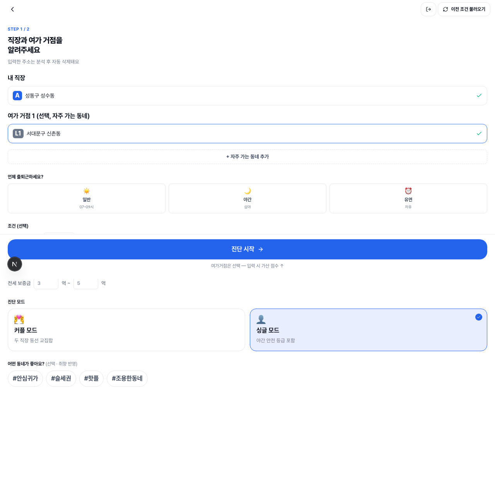
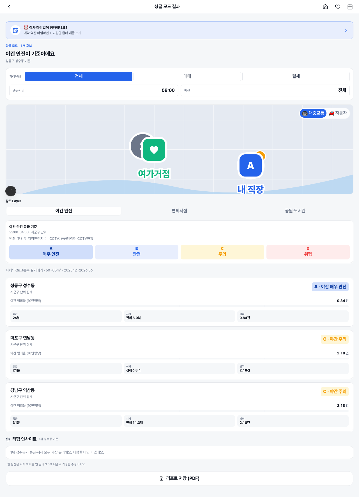

# OnDay Happy Path E2E — 시각 리포트

OnDay의 두 핵심 시나리오를 Playwright로 검증하고 단계별 스크린샷을 캡처한 리포트입니다.
**맞벌이 부부(커플 모드)** 와 **1인 가구(싱글 모드)** 를 모두 커버함을 시각으로 증명합니다.

- 스펙: [`e2e/happy-path.spec.ts`](happy-path.spec.ts)
- 실행: `npm run e2e` (HTML 리포트: `npm run e2e:report`)
- 결과: ✅ **2 passed** (chromium) — 커플 · 싱글

## ★ DB 안전성 (테스트 격리)

- mock 모드여도 `/api/diagnosis`(POST)는 실 클라우드 DB에 저장하므로, 스펙이 `page.route`로
  **요청을 인터셉트**하여 fixture로 응답합니다. **커플·싱글 모두 같은 엔드포인트**라 한 인터셉트로 차단.
- 요청이 서버에 닿지 않음 → `prisma.diagnosis.create` 미실행 → **실 `diagnoses` 테이블 쓰기 0**.
- 검증: fixture id `e2e-fixture-001`가 실 DB에 **존재하지 않음**, 기존 351 rows 무변경.

## ★ 결과 지도 (정직성 주석)

- E2E 결과 지도는 **외부 의존 0**을 위해 `NEXT_PUBLIC_KAKAO_MAP_KEY=""`로 두어 OnDay의
  **SVG placeholder 지도**(격자+한강+추천마커+직장핀+여가거점핀+연결선)로 캡처합니다.
- 헤드리스에서 외부 카카오 SDK 타일이 안 그려져 백지가 되던 문제를 결정적으로 해결한 것입니다.
- **라이브(onday-design-project.vercel.app)에선 카카오 실지도**가 뜨며, SDK 로드 실패 시 동일한
  SVG placeholder로 자동 degrade합니다(`map-canvas.tsx:91,136`). 즉 이 SVG는 라이브의 fallback과 동일합니다.

---

## 🧑‍🤝‍🧑 커플 모드 — 두 직장 동선 교집합

맞벌이 부부가 **두 직장**을 입력하면 통근 동선이 만나는 후보 동네를 추천.

### ① 랜딩 — 서비스 가치 노출

### ② 로그인 — mock 원클릭
"카카오로 1초 만에 시작" 원클릭으로 진단 화면 진입(실 OAuth 불필요).

### ③ 두 직장 주소 입력 — 자동완성 선택
"내 직장"(공덕동)·"배우자 직장"(역삼동)을 선택 → 둘 다 `verified`(그린 체크), "진단 시작" 활성.

### ④ 추천 동네 결과 — 후보 + BEST + 지도(직장 A·B)
"후보 3개 동네" + 마포구 공덕동 **BEST**(92점) + **SVG 지도(직장 A·B 핀 + 후보 마커 + 연결선)**.

---

## 🧍 싱글 모드 — 직장 + 여가거점 (배우자 입력 없음)

1인 가구가 **직장 1곳 + 여가거점**을 입력하면 **야간 안전 등급**을 포함해 추천.
커플과 달리 배우자 입력이 없고, 내 직장만으로 진단이 활성됩니다.

### ① 싱글 입력 — 모드 토글 + 직장 + 여가거점
싱글 모드로 전환(배우자 입력 사라짐) → "내 직장"(성수동) + "여가 거점 1"(신촌동) 선택.

### ② 싱글 결과 — 야간 안전 등급 + 지도(직장 + 여가거점)
"싱글 모드 결과" + 야간 안전 등급(A 매우 안전 ~ D 위험) + 후보 3개 + **SVG 지도(내 직장 A + 여가거점 핀)**.

---

## 모드 비교 (E2E가 증명하는 차이)

| | 커플 모드 | 싱글 모드 |
| --- | --- | --- |
| 입력 | 내 직장 + **배우자 직장** | 내 직장 + **여가거점**(배우자 없음) |
| 진단 활성 조건 | 두 직장 모두 verified | **내 직장만** verified |
| 결과 라우트 | `/diagnosis/result/[id]` | `/single/[id]` |
| 결과 특징 | 동선 교집합 · 통근 A·B | **야간 안전 등급** · 여가거점 |
| 지도 마커 | 직장 A·B + 후보 | 직장 A + **여가거점** + 후보 |

## 셀렉터 노트 (data-testid 0개 → role/text 기반)

| 단계 | 셀렉터 |
| --- | --- |
| mock 로그인 | `getByRole('button', { name: '카카오로 1초 만에 시작' })` |
| 싱글 모드 토글 | `getByRole('radio', { name: /싱글 모드/ })` |
| 주소 입력 | `getByLabel('내 직장')` / `getByLabel('배우자 직장')` / `getByLabel(/여가 거점 1/)` |
| 자동완성 선택 | `getByRole('option', { name: /공덕동/ })` (debounce 300ms → auto-wait) |
| 진단 시작 | `getByRole('button', { name: '진단 시작' })` |
| 커플 결과 | `getByText(/후보 \d+개 동네/)` + `getByText('BEST')` |
| 싱글 결과 | `getByRole('heading', { name: '싱글 모드 결과' })` |
| 결과 지도 | `[aria-label="후보 동네 지도"]` + `[aria-label="내 직장"]`(SVG 직장핀) |
