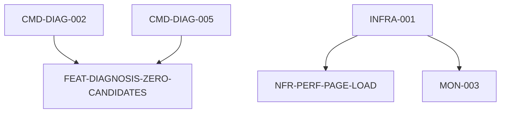

# 개발 태스크(Task) 목록 명세서

**Document ID:** TASK-001
**Source:** SRS-001 Rev 1.7 (2026-05-27) — PRD/SRS audit 정합 회복
**작성 기준:** SRS에 명시된 기능적/비기능적 요구사항만을 기반으로 도출
**작성 원칙:** Contract-First → CQRS 분리 → AC→Test 변환 → NFR 추출 + 의존성 매핑

---

## v1.4 변경 이력 (2026-05-27)

> **변경 사유:** PRD/SRS audit 결과 미반영 요구사항을 v1.3 위에 정합 회복한다. v1.3 결정 폐기 1건(MON-003) 번복 + 신설 2건 + 확장 3건 + SRS v1.7 연기 표기 2건.

### 신설 태스크 (2건)

| Task ID | 본질 | 매핑 REQ | Track | Wave | 복잡도 | Priority |
|---|---|---|---|---|---|---|
| **FEAT-DIAGNOSIS-ZERO-CANDIDATES** | 진단 교집합 0곳 안내 1초 + 조건 완화 제안 ≥2개 | REQ-FUNC-008 (Story 3-1, AC-N3) | diagnosis-be | 3 | M | Must |
| **NFR-PERF-PAGE-LOAD** | 일반 페이지 로딩 p95 ≤ 1500ms (Lighthouse + Vercel Speed Insights) | REQ-NF-002 | test-nfr | 5 | M | Must |

### 부활 태스크 (1건) — v1.3 결정 번복

| Task ID | v1.3 결정 | v1.4 부활 사유 | 매핑 REQ |
|---|---|---|---|
| **MON-003** (Amplitude/Mixpanel 이벤트 트래킹) | "Sentry 기본 알림만 유지" — out of scope | Mixpanel 무료 티어 100K 이벤트/월 = 1인 MVP 사실상 무한 무료. 측정 도구 없이 REQ-NF-008 검증 불가 | REQ-NF-008 |

### 확장 태스크 (3건)

| Task ID | v1.3 범위 | v1.4 확장 | 흡수 REQ |
|---|---|---|---|
| **UI-007** | SSR 공유 리포트 페이지 데이터 출처 배지 | 개인 진단 결과 페이지(UI-003/004) 출처 배지 추가 — "리포트 내 모든 데이터 항목" 정합 회복 | REQ-FUNC-012 |
| **UI-009** | 데드라인 모드 입력 화면 (날짜 선택기 과거 차단 언급) | AC 명시 강화 — 100ms 이내 인라인 에러 + 서버 도달률 0% | REQ-FUNC-020 |
| **MON-001** | Sentry 에러 추적 + 기본 알림 | Uptime 모니터링(/api/health + 5분 주기 핑) + 5xx 오류율 ≤ 0.5% 측정 | REQ-NF-011, REQ-NF-012 |

### SRS v1.7 연기 표기 (v1.4 TASK_LIST 미반영)

| REQ ID | 본질 | v1.5+ 적용 사유 |
|---|---|---|
| REQ-NF-005 | 급매 데이터 갱신 ≤ 4시간 (Vercel Cron Job) | MVP는 mock 데이터 사용 — Cron이 갱신할 실 데이터 없음. v1.3 INFRA-003 "Cron Job 설정 제거" 정합. 실 부동산 API 연동 시점에 부활 |
| REQ-NF-013 | 교통 시간 오차 ≤ ±10% (카카오맵 기준 주간 100건 샘플) | MVP는 mock 데이터 — 카카오맵 비교 의미 X. 실 카카오 모빌리티 API 연동 시점에 부활 |

### 박힘률 변화 (사용자 명시)

| 분류 | v1.3 | v1.4 | 변화 |
|---|---|---|---|
| REQ-FUNC 박힘률 | 67.5% | 75.6% | +8.1%p (FUNC-008/012/020 흡수) |
| REQ-NF 박힘률 | 36.8% | 52.6% | +15.8%p (NF-002/008/011/012 흡수) |

### v1.4 의의

- v1.3 결정 폐기 1건 번복(MON-003) — 결정 번복은 v1.4 changelog로 정직 기록
- v1.5+ 연기 2건은 SRS v1.7에 표기 추가, TASK_LIST에서는 제외 (실 데이터 연동 시점에 부활)
- 보드 변화: 30칸 → 33칸 (신설 3건 추가)

---

## v1.3 변경 이력 (2026-04-22)

> **변경 사유:** AI 에이전트가 미작성 태스크 5개를 선별하여 GitHub Issue 상세 명세를 작성하는 워크플로우를 지원하기 위한 메타데이터 보강.

### 추가된 메타데이터

| 항목 | 설명 |
|---|---|
| Issue 상태 컬럼 | 모든 Step 1~5 태스크 표에 `Issue 상태` 컬럼 추가 (초기값: `⬜ 미작성`) |
| 참조 문서 경로 테이블 | 문서 상단에 `📁 참조 문서 경로` 섹션 신설 |
| AC 요약 인라인 | Step 2~3 태스크에 `↳ AC:` 서브필드 추가 |
| NFR 매핑 주석 | Step 2 Command/Query 중 해당 태스크에 `↳ NFR:` 서브필드 추가 |
| 미작성 태스크 조회 가이드 | 문서 맨 끝에 AI Agent 전용 조회 가이드 섹션 신설 |

### 변경 원칙

- 기존 태스크의 Task ID, Epic, Feature 본문, 복잡도, 선행 태스크 값은 변경하지 않음
- 태스크 총 개수 73개 유지 (증감 없음)
- AC 요약/NFR 매핑은 기존 태스크 파일과 SRS 참조 표현에서 추론 가능한 범위에서만 수행

---

## v1.2 변경 이력 (2026-04-18)

> **변경 사유:** SRS Rev 1.6 반영 — Auth 스택 Supabase Auth 전환 + 결제 도메인 MVP 제외

### 제거된 태스크

| Task ID | 기능명 | 제거 사유 |
|---|---|---|
| DB-005 | PAYMENT 테이블 Prisma 스키마 | SRS Rev 1.6 결제 도메인 MVP 제외에 따라 |
| API-004 | Payment 도메인 DTO | SRS Rev 1.6 결제 도메인 MVP 제외에 따라 |
| API-008 | 토스페이먼츠 PG 연동 인터페이스 | SRS Rev 1.6 결제 도메인 MVP 제외에 따라 |
| MOCK-003 | 결제 프로세스 Mock 데이터 | SRS Rev 1.6 결제 도메인 MVP 제외에 따라 |
| CMD-PAY-001 | 결제 요청 initiateCheckout | SRS Rev 1.6 결제 도메인 MVP 제외에 따라 |
| CMD-PAY-002 | PG 웹훅 처리 | SRS Rev 1.6 결제 도메인 MVP 제외에 따라 |
| CMD-PAY-003 | PG사 장애 에러 모달 | SRS Rev 1.6 결제 도메인 MVP 제외에 따라 |
| QRY-PAY-001 | 결제 이력 조회 | SRS Rev 1.6 결제 도메인 MVP 제외에 따라 |
| TEST-009 | 결제 GWT 시나리오 | SRS Rev 1.6 결제 도메인 MVP 제외에 따라 |
| UI-015 | 결제 화면 UI | SRS Rev 1.6 결제 도메인 MVP 제외에 따라 |

### 수정된 태스크

| Task ID | 변경 내용 |
|---|---|
| CMD-AUTH-001 | NextAuth.js v5 카카오 OAuth → Supabase Auth 카카오 OAuth Provider 설정 |
| CMD-AUTH-002 | NextAuth.js v5 네이버 OAuth → Supabase Auth 네이버 OAuth Provider 설정 |
| CMD-AUTH-003 | NextAuth.js 세션 전략 → Supabase Auth 세션 전략 (@supabase/ssr) |
| DB-007 | NextAuth.js Prisma Adapter → Supabase Auth 연동 USER 스키마 정렬, 복잡도 M→L |
| API-001 | NextAuth.js 세션 객체 → Supabase Session 객체, @supabase/ssr 타입 |
| MOCK-005 | NextAuth 언급 → Supabase Auth 치환 |
| TEST-008 | NextAuth 세션 → Supabase Auth 세션, CSRF 검증 제거 |
| UI-001 | Supabase Auth signInWithOAuth() 호출 구현 방식 주석 추가 |
| TEST-010 | "회원가입→진단→공유→결제→리포트 해금" → "회원가입→진단→공유→리포트 열람" |

---

## v1.1 변경 이력 (2026-04-18)

> **변경 사유:** SRS Rev 1.5 MVP 스코프 축소에 따라 태스크 목록을 재정렬한다.

### 제거된 태스크

| Task ID | 기능명 | 제거 사유 |
|---|---|---|
| DB-008 | 행정동 코드 매핑 Seed 데이터 | REQ-FUNC-028 제거 (행정동 변경 감지 삭제) |
| DB-009 | 경찰청 범죄 통계 캐시 테이블 Seed | Could 기능용, v1으로 연기. 정적 에셋은 앱 내 JSON으로 대체 |
| DB-010 | 교육부 학교 배정 구역 Seed | Could 기능(REQ-FUNC-035)용, v1으로 연기 |
| CMD-SAVE-002 | 행정동 변경 감지 및 자동 매핑 | REQ-FUNC-028 제거 |
| CMD-SAVE-003 | 시나리오별 동선 변화 비교 | REQ-FUNC-027 제거 |
| CMD-CRON-001 | 급매 매물 4시간 주기 배치 적재 | MVP 단계 크롤링 제거 |
| CMD-CRON-002 | 경찰청 범죄 통계 분기별 배치 갱신 | MVP 단계 배치 제거, 정적 에셋 대체 |
| SEC-001 | AES-256 PII 암호화 | REQ-NF-017 제거, Supabase TLS만 사용 |
| SEC-003 | OWASP DAST 스캔 | REQ-NF-019 제거 |
| MON-002 | Vercel Analytics + Sentry Performance p95 슬랙 경고 | Sentry 기본 알림만 유지 |
| MON-003 | Amplitude/Mixpanel 이벤트 트래킹 + 전환 퍼널 이상 감지 | Sentry 기본 알림만 유지 *(★ v1.4에서 부활)* |
| MON-004 | API 호출량/비용 슬랙 경고 | Sentry 기본 알림만 유지 |

### 수정된 태스크

| Task ID | 변경 내용 |
|---|---|
| QRY-SAVE-001 | 재계산 로직·비교 뷰 제거 → "저장된 값을 입력 폼에 채우기"만 남김 |
| API-005 | `replaySearch()` DTO 제거, `saveSearch()` + `getSavedSearch()` 만 유지 |
| TEST-007 | AC-1(저장 best effort) 시나리오만 남기고 AC-2/3/N1 제거 |
| INFRA-003 | Cron Job 설정 제거 (CMD-CRON 전체 삭제에 따라) |
| CMD-SINGLE-001 | DB-009 의존성 제거, 정적 JSON 에셋 직접 참조로 변경 |
| QRY-SINGLE-001 | DB-009 의존성 제거, 정적 JSON 에셋 기반으로 변경 |
| UI-014 | 비교 뷰 제거 → "이전 조건 불러오기 버튼 + 폼 자동 채움" UI로 축소 |

---

## 📁 참조 문서 경로

| 논리 참조 | 실제 파일 경로 |
|---|---|
| SRS 원본 | `/docs/05_SRS_v1.7.md` *(v1.6 → v1.7 갱신, 2026-05-27)* |
| PRD 원본 | `/docs/00_PRD_v1.1-rev.4.md` |
| ERD | SRS 원본 §6.2.0 ERD 섹션 내 인라인 |
| API 명세 | SRS 원본 §6.1 API Endpoint List 섹션 내 인라인 |
| 시퀀스 다이어그램 | SRS 원본 §6.3 Detailed Interaction Models 섹션 내 인라인 |
| 태스크 목록 | `/tasks/06_TASK_LIST_v1_4.md` (본 문서) |
| Issue 등록 로그 | `/tasks/ISSUE_REGISTER_LOG.md` |
| Issue 상세 명세 출력 | `/tasks/{TASK_ID}.md` |

---

## 목차

1. [Step 1. 계약·데이터 명세 태스크 (Contract & Data)](#step-1-계약데이터-명세-태스크)
2. [Step 2. 로직·상태 변경 태스크 (Query / Command)](#step-2-로직상태-변경-태스크)
3. [Step 3. 테스트 태스크 (AC → Test)](#step-3-테스트-태스크)
4. [Step 4. 비기능 제약·인프라 태스크 (NFR)](#step-4-비기능-제약인프라-태스크)
5. [Step 5. UI/UX 프론트엔드 태스크](#step-5-uiux-프론트엔드-태스크)
6. [의존성 그래프](#의존성-그래프)
7. [실행 순서 가이드](#실행-순서-가이드)

> v1.4 변경: Step 2-B (Diagnosis 도메인)에 FEAT-DIAGNOSIS-ZERO-CANDIDATES 추가, Step 4-C (모니터링)에 MON-003 부활, Step 4-D 신규 (성능 측정) 신설.

---

## Step 1. 계약·데이터 명세 태스크

> v1.3 본문 그대로. 변경 없음.

### 1-A. 데이터베이스 스키마

DB-001 ~ DB-007 — v1.3 그대로.

### 1-B. API 통신 계약 (DTO / 에러 코드)

API-001 ~ API-007 — v1.3 그대로.

### 1-C. Mock 데이터

MOCK-001 ~ MOCK-005 — v1.3 그대로.

---

## Step 2. 로직·상태 변경 태스크

> **v1.4 변경:** Step 2-B에 FEAT-DIAGNOSIS-ZERO-CANDIDATES 1건 신설.

### 2-A. Auth 도메인

CMD-AUTH-001 ~ CMD-AUTH-004 — v1.3 그대로.

### 2-B. Diagnosis 도메인 (두 동선 교차 진단 — F1)

CMD-DIAG-001 ~ CMD-DIAG-007, QRY-DIAG-001/002 — v1.3 그대로.

**v1.4 신설:**

| Task ID | Epic | Feature (기능명) | 관련 SRS 섹션 | 선행 태스크 | 복잡도 | Priority | Issue 상태 |
|---|---|---|---|---|---|---|---|
| **FEAT-DIAGNOSIS-ZERO-CANDIDATES** | Diagnosis | [Feature] 진단 교집합 0곳 안내 + 조건 완화 제안 2개 이상 ↳ AC: 0곳 안내 ≤1초 표시, 조건 완화 제안 ≥2개 (예: "최대 통근 시간 +10분", "예산 ±5천만원") ↳ NFR: 안내 표시 ≤1초 (REQ-FUNC-008), Sentry 에러 추적 (REQ-NF-035) | §4.1.1 REQ-FUNC-008, Story 3-1 AC-N3 | CMD-DIAG-002, CMD-DIAG-005 | M | Must | ⬜ 미작성 |

> CMD-DL-003은 데드라인 모드 0건 처리(REQ-FUNC-019). FEAT-DIAGNOSIS-ZERO-CANDIDATES는 진단 모드 0건 처리(REQ-FUNC-008). 두 영역은 별개.

### 2-C. ShareLink 도메인 / 2-E. Deadline / 2-F. Single / 2-G. SavedSearch

v1.3 그대로.

---

## Step 3. 테스트 태스크

> TEST-001~010 v1.3 그대로. FEAT-DIAGNOSIS-ZERO-CANDIDATES는 기존 TEST-001(AC-N3) 시나리오에 자연 포함.

---

## Step 4. 비기능 제약·인프라 태스크

> **v1.4 변경:**
> - **4-C (모니터링·관측성)** — MON-003 부활 (v1.3 결정 번복)
> - **4-D (성능 측정 — 신설)** — NFR-PERF-PAGE-LOAD 신설

### 4-A. 인프라 및 DevOps

INFRA-001 ~ INFRA-005 — v1.3 그대로.

### 4-B. 보안

SEC-002 — v1.3 그대로.

### 4-C. 모니터링·관측성

| Task ID | Epic | Feature (기능명) | 관련 SRS 섹션 | 선행 태스크 | 복잡도 | Priority | Issue 상태 |
|---|---|---|---|---|---|---|---|
| MON-001 | Observability | Sentry 기본 통합 — 에러 추적 + Sentry 기본 알림 + **v1.4 확장: Uptime 모니터링(/api/health + 5분 주기 핑) + 5xx 오류율 ≤ 0.5% 측정** | §4.2.6 REQ-NF-035, **§4.2.2 REQ-NF-011, REQ-NF-012**, §6.6 Observability, CON-17 | INFRA-001 | M | Must | ✅ 작성완료 + v1.4 확장 |
| **MON-003** *(v1.4 부활)* | Observability | [부활] Mixpanel 이벤트 트래킹 — `diagnosis_started`/`diagnosis_completed` 타임스탬프 기반 평균 탐색 완료 시간 p50 측정 ↳ AC: Mixpanel SDK 통합, 진단 시작·완료 이벤트 추적, p50 ≤ 10분 측정 가능 ↳ NFR: Sentry 에러 추적 (REQ-NF-035) | §4.2.5 REQ-NF-008, PRD §1-3 보조 KPI 6 | INFRA-001 | M | Must | ⬜ 미작성 (v1.4 부활) |

> **MON-003 v1.4 부활 사유:** Mixpanel 무료 티어 100K 이벤트/월 = 1인 MVP 평생 무료 수준. 측정 도구 없이 REQ-NF-008 (탐색 완료 p50 ≤ 10분) 검증 불가. v1.3 폐기 사유 "비용 부담" 해당 없음.

### 4-D. 성능 측정 *(v1.4 신설)*

| Task ID | Epic | Feature (기능명) | 관련 SRS 섹션 | 선행 태스크 | 복잡도 | Priority | Issue 상태 |
|---|---|---|---|---|---|---|---|
| **NFR-PERF-PAGE-LOAD** | Performance | [NFR] 일반 페이지 로딩 p95 ≤ 1500ms 측정 + 모니터링 (Lighthouse CI + Vercel Speed Insights) ↳ AC: Lighthouse CI 통과, Speed Insights p95 대시보드 ≤ 1500ms ↳ NFR: 페이지 로딩 p95 ≤ 1500ms (REQ-NF-002) | §4.2.1 REQ-NF-002, PRD §5-1 | INFRA-001 | M | Must | ⬜ 미작성 |

### 4-E. v1.5+ 연기 (TASK_LIST 미반영, SRS v1.7 표기 추가)

| REQ ID | v1.4 미반영 사유 |
|---|---|
| REQ-NF-005 (Cron 4시간) | mock 데이터 → 갱신할 실 데이터 없음. v1.3 INFRA-003 정합. 실 부동산 API 연동 시점 부활 |
| REQ-NF-013 (교통 ±10%) | mock 데이터 → 카카오맵 비교 의미 X. 실 카카오 모빌리티 API 연동 시점 부활 |

---

## Step 5. UI/UX 프론트엔드 태스크

> **v1.4 변경:** UI-007, UI-009 명세 확장.

| Task ID | Epic | v1.3 범위 | v1.4 확장 | 관련 SRS 섹션 (v1.4) |
|---|---|---|---|---|
| UI-007 | UI: ShareLink | SSR 공유 리포트 페이지 출처 배지 (REQ-FUNC-011/012) | 개인 진단 결과 페이지(`/diagnosis/result/[id]`) 출처 배지 추가 | **§4.1.1 REQ-FUNC-012** (리포트 내 모든 데이터) + §4.1.2 |
| UI-009 | UI: Deadline | 데드라인 모드 입력 화면 (날짜 선택기 과거 차단 언급) | AC 명시 강화 — 100ms 이내 인라인 에러 + 서버 도달률 0% | §4.1.3 REQ-FUNC-015/020 |

> 나머지 UI-001~006, UI-008, UI-010~014 v1.3 그대로.

---

## 의존성 그래프 (v1.4 변경 영역만)

(전체 v1.3 의존성 그래프는 그대로 유효)

---

## 실행 순서 가이드 (v1.4 추가)

### Wave 3 (병렬 트랙 G — 진단 핵심)

- FEAT-DIAGNOSIS-ZERO-CANDIDATES — CMD-DIAG-002 후행

### Wave 5 (트랙 Q — 모니터링)

- MON-001 v1.4 확장 (Uptime + 5xx)
- **MON-003** 부활 (Mixpanel)
- **NFR-PERF-PAGE-LOAD** 신설 (Lighthouse + Speed Insights)

---

## 태스크 요약 통계 (v1.4)

| 카테고리 | v1.3 | v1.4 | 변화 |
|---|---|---|---|
| Step 2: Command (Diagnosis) | 9 | 10 | +1 (FEAT-DIAGNOSIS-ZERO-CANDIDATES) |
| Step 4: Observability | 1 | 2 | +1 (MON-003 부활) |
| Step 4: Performance | 0 | 1 | +1 (NFR-PERF-PAGE-LOAD 신설) |
| **합계** | **73** | **76** | **+3** |

---

## v1.4 신설/확장 ID 추적표

| Task ID | 유형 | GitHub Issue # | 매핑 REQ | tasks/{ID}.md |
|---|---|---|---|---|
| FEAT-DIAGNOSIS-ZERO-CANDIDATES | 신설 | (Phase D 신설 예정) | REQ-FUNC-008 | (Phase D 신설 예정) |
| NFR-PERF-PAGE-LOAD | 신설 | (Phase D 신설 예정) | REQ-NF-002 | (Phase D 신설 예정) |
| MON-003 | 부활 | (Phase D 신설 예정) | REQ-NF-008 | tasks/MON-003.md (v1.4 신설) |
| UI-007 | 확장 | #45 (기존) | REQ-FUNC-012 추가 | tasks/UI-007.md (v1.4 확장 § 추가) |
| UI-009 | 확장 | #52 (기존) | REQ-FUNC-020 AC 강화 | tasks/UI-009.md (v1.4 확장 § 추가) |
| MON-001 | 확장 | #73 (기존) | REQ-NF-011 + REQ-NF-012 흡수 | tasks/MON-001.md (v1.4 확장 § 추가) |

---

> **Software Requirements Specification (SRS)** 기반 개발 태스크 목록 | Source: SRS-001 Rev 1.7
> 
> *본 문서는 SRS에 명시된 요구사항만을 기반으로 도출되었으며, SRS에 없는 기능을 임의 추가하지 않았습니다.*
> *v1.1: SRS Rev 1.5 MVP 스코프 축소 반영 — 12개 태스크 제거, 7개 태스크 수정 (94건 → 79건)*
> *v1.2: SRS Rev 1.6 반영 — Auth 스택 Supabase Auth 전환, Payment 도메인 전체 제거 (10개 태스크 제거, 9개 태스크 수정)*
> *v1.3: AI Agent 워크플로우 지원 메타데이터 보강 (2026-04-22, 73개 유지)*
> *v1.4: PRD/SRS audit 정합 회복 — 신설 2건 + 부활 1건(MON-003 v1.3 결정 번복) + 확장 3건 + SRS v1.7 연기 표기 2건 (2026-05-27, 73 → 76)*
