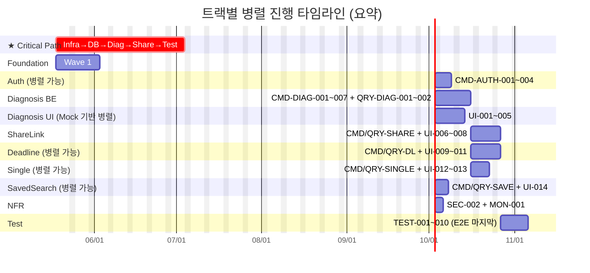

# 개발 간트 차트 명세서 (Gantt Chart)

> **Document ID:** GANTT-001
> **기준 문서:** [`06_TASK_LIST_v1.3.md`](./06_TASK_LIST_v1.3.md)
> **작성 원칙:** 의존성 그래프 + Wave 가이드를 기준으로 병렬 진행 가능한 트랙을 시각화

---

## 📋 메타 정보

| 항목 | 값 |
|---|---|
| **작성일** | 2026-05-14 |
| **기준 문서** | `tasks/06_TASK_LIST_v1.3.md` (TASK-001, SRS-001 Rev 1.6) |
| **총 태스크 수** | **73개** (DB 6 + API 6 + Mock 4 + Command 21 + Query 7 + Test 9 + Infra 4 + Sec 1 + Obs 1 + UI 14) |
| **크리티컬 패스 길이** | **14단계** (INFRA-001 → DB-001 → DB-002 → DB-003 → API-002 → MOCK-001 → CMD-DIAG-001 → CMD-DIAG-002 → CMD-DIAG-003 → CMD-DIAG-004 → CMD-SHARE-001 → QRY-SHARE-001 → TEST-003 → TEST-010) |
| **병렬 가능 트랙 수** | **9개 트랙** (Foundation / Auth / Diagnosis BE / Diagnosis UI / ShareLink / Deadline / Single / SavedSearch / Test+NFR) |
| **추정 총 소요** | **약 30 영업일** (1인 기준, 복잡도 L=1d / M=2d / H=3d 가정) |
| **병렬 진행 시 단축 가능** | **약 18 영업일** (이론적 critical path 합) |

---

## 🗂️ 1. 전체 간트 차트 (Mermaid)

```mermaid
gantt
    title OnDay(온데이) 개발 간트 차트 v1.0 — 병렬 트랙 기반
    dateFormat  YYYY-MM-DD
    axisFormat  %m/%d
    excludes    weekends

    %% ==========================================
    %% Section 0. 크리티컬 패스 (Critical Path)
    %% ==========================================
    section ★ Critical Path
    INFRA-001 Next.js+Vercel 초기화        :crit, cp1, 2026-05-18, 2d
    DB-001 Prisma 초기화                    :crit, cp2, after cp1, 3d
    DB-002 USER 스키마                      :crit, cp3, after cp2, 3d
    DB-003 DIAGNOSIS 스키마                 :crit, cp4, after cp3, 2d
    API-002 Diagnosis DTO                  :crit, cp5, after cp4, 2d
    MOCK-001 Diagnosis Mock                :crit, cp6, after cp5, 3d
    CMD-DIAG-001 Geocoding                 :crit, cp7, after cp6, 2d
    CMD-DIAG-002 교집합 산출                :crit, cp8, after cp7, 3d
    CMD-DIAG-003 ScoringEngine             :crit, cp9, after cp8, 3d
    CMD-DIAG-004 진단 결과 저장             :crit, cp10, after cp9, 2d
    CMD-SHARE-001 공유 링크 생성            :crit, cp11, after cp10, 2d
    QRY-SHARE-001 공유 리포트 SSR           :crit, cp12, after cp11, 3d
    TEST-003 공유 GWT                      :crit, cp13, after cp12, 3d
    TEST-010 E2E 통합                      :crit, cp14, after cp13, 3d

    %% ==========================================
    %% Section 1. Foundation (Wave 1)
    %% ==========================================
    section Foundation: Infra
    INFRA-001 Next.js+Vercel               :done, infra1, 2026-05-18, 2d
    INFRA-002 Supabase DB 프로비저닝       :infra2, after infra1, 1d
    INFRA-004 Tailwind+shadcn 설정         :infra4, after infra1, 1d
    INFRA-005 Vercel AI SDK+Gemini         :infra5, after infra1, 2d

    section Foundation: DB
    DB-001 Prisma 초기화                    :db1, after infra1, 3d
    DB-002 USER 스키마                      :db2, after db1, 3d
    DB-003 DIAGNOSIS 스키마                 :db3, after db2, 2d
    DB-004 SHARE_LINK 스키마                :db4, after db3, 3d
    DB-006 SAVED_SEARCH 스키마              :db6, after db2, 3d
    DB-007 Supabase Auth 정렬               :db7, after db2, 3d

    section Foundation: API Contract
    API-006 공통 에러 코드                  :api6, 2026-05-18, 2d
    API-007 카카오 API 인터페이스           :api7, 2026-05-18, 3d
    API-001 Auth DTO                       :api1, after db7, 2d
    API-002 Diagnosis DTO                  :api2, after db3, 2d
    API-003 ShareLink DTO                  :api3, after db4, 2d
    API-005 SavedSearch DTO                :api5, after db6, 3d

    section Foundation: Mock
    MOCK-001 Diagnosis Mock                :mock1, after api2, 3d
    MOCK-002 ShareLink Mock                :mock2, after api3, 3d
    MOCK-004 카카오 API Mock                :mock4, after api7, 3d
    MOCK-005 OAuth Mock                    :mock5, after api1, 3d

    %% ==========================================
    %% Section 2. Auth 트랙
    %% ==========================================
    section Auth (Backend)
    CMD-AUTH-001 카카오 OAuth Provider     :auth1, after api1 mock5, 3d
    CMD-AUTH-002 네이버 OAuth Provider     :auth2, after auth1, 2d
    CMD-AUTH-003 세션 전략 (@supabase/ssr) :auth3, after auth1, 2d
    CMD-AUTH-004 게스트 임시 체험 모드     :auth4, after auth1, 1d

    %% ==========================================
    %% Section 3. Diagnosis BE 트랙 (F1)
    %% ==========================================
    section Diagnosis BE
    CMD-DIAG-001 Geocoding                 :diag1, after api7, 2d
    CMD-DIAG-002 교집합 후보 동네           :diag2, after diag1 mock4, 3d
    CMD-DIAG-003 ScoringEngine             :diag3, after diag2, 3d
    CMD-DIAG-004 진단 결과 저장             :diag4, after diag2 api2, 2d
    QRY-DIAG-001 진단 결과 조회             :qdiag1, after db3 api2, 1d
    QRY-DIAG-002 출퇴근 시간 조회           :qdiag2, after diag2, 2d
    CMD-DIAG-005 조건 필터 실시간           :diag5, after diag2, 2d
    CMD-DIAG-006 교통 API 타임아웃          :diag6, after diag2, 2d
    CMD-DIAG-007 수도권 커버리지 검증       :diag7, after diag1, 1d

    %% ==========================================
    %% Section 4. Diagnosis UI 트랙 (병렬)
    %% ==========================================
    section Diagnosis UI
    UI-001 소셜 로그인 페이지               :ui1, after infra4 mock5, 1d
    UI-002 주소 입력 화면                   :ui2, after infra4 mock1, 2d
    UI-003 지도 시각화                     :ui3, after infra4 mock1 mock4, 3d
    UI-004 후보 동네 상세 패널              :ui4, after ui3, 2d
    UI-005 조건 필터 UI                    :ui5, after ui3, 2d

    %% ==========================================
    %% Section 5. ShareLink 트랙 (F2)
    %% ==========================================
    section ShareLink
    CMD-SHARE-001 공유 링크 생성            :share1, after diag4 api3, 2d
    QRY-SHARE-001 공유 리포트 SSR           :share2, after share1, 3d
    CMD-SHARE-002 viewCount 증가            :share3, after share2, 1d
    CMD-SHARE-003 만료 링크 안내            :share4, after share2, 2d
    CMD-SHARE-004 비밀번호 검증             :share5, after share2, 1d
    UI-006 공유 링크 생성 버튼              :ui6, after infra4 mock2, 1d
    UI-007 SSR 공유 리포트 페이지           :ui7, after infra4 mock2, 3d
    UI-008 회원가입 유도 모달               :ui8, after ui7, 2d

    %% ==========================================
    %% Section 6. Deadline 트랙 (F3)
    %% ==========================================
    section Deadline Mode
    CMD-DL-001 데드라인 활성화              :dl1, after diag4, 3d
    QRY-DL-001 교집합 매물 조회             :qdl1, after dl1, 2d
    CMD-DL-002 아웃링크 URL 조합            :dl2, after dl1, 1d
    CMD-DL-003 0건 시 조건 완화 제안        :dl3, after qdl1, 2d
    QRY-DL-002 30분 요약                   :qdl2, after qdl1, 2d
    UI-009 데드라인 입력 화면               :ui9, after infra4, 2d
    UI-010 급매 리스트+지도                 :ui10, after ui9, 2d
    UI-011 30분 요약 카드                   :ui11, after ui10, 1d

    %% ==========================================
    %% Section 7. Single 트랙 (F4)
    %% ==========================================
    section Single Mode
    CMD-SINGLE-001 싱글 모드 진단           :sg1, after diag2, 2d
    QRY-SINGLE-001 야간 안전 등급           :qsg1, after sg1, 2d
    CMD-SINGLE-002 리포트 저장 (print)     :sg2, after sg1, 1d
    UI-012 싱글 모드 진단 화면              :ui12, after infra4, 2d
    UI-013 야간 안전 등급 표시              :ui13, after ui12, 1d

    %% ==========================================
    %% Section 8. SavedSearch 트랙 (F5)
    %% ==========================================
    section SavedSearch
    CMD-SAVE-001 입력값 자동 저장           :sv1, after db6 api5, 2d
    QRY-SAVE-001 저장된 조건 불러오기       :qsv1, after sv1, 1d
    UI-014 이전 조건 불러오기 UI           :ui14, after infra4, 1d

    %% ==========================================
    %% Section 9. Test + NFR (Wave 5)
    %% ==========================================
    section NFR / DevOps
    SEC-002 Rate Limiting                  :sec2, after infra1, 2d
    MON-001 Sentry 기본 통합                :mon1, after infra1, 2d

    section Test
    TEST-001 진단 GWT                      :t1, after diag2 diag4 diag7, 3d
    TEST-002 교통 타임아웃 핸들링           :t2, after diag6, 2d
    TEST-003 공유 링크 GWT                 :t3, after share1 share2 share4, 3d
    TEST-004 공유 링크 보안                 :t4, after share1 share5, 2d
    TEST-005 데드라인 GWT                  :t5, after dl1 dl3, 2d
    TEST-006 싱글 모드 GWT                 :t6, after sg1 qsg1 sg2, 2d
    TEST-007 간이 저장 시나리오             :t7, after sv1 qsv1, 1d
    TEST-008 OAuth GWT                     :t8, after auth1 auth2 auth3 auth4, 2d
    TEST-010 E2E 통합                      :t10, after t1 t3 t5 t6 t7 t8, 3d
```



---

## 🛤️ 2. 트랙별 분해 간트 (병렬 진행 시각화)

크리티컬 패스와 병렬 진행 가능한 트랙들이 어떻게 겹치는지 한눈에 보기 위한 간소화 차트.



---

## 🚦 3. 크리티컬 패스 상세

> 이 패스가 지연되면 전체 프로젝트가 지연됩니다.

| 순서 | Task ID | 소요(d) | 누적(d) | 비고 |
|---|---|---|---|---|
| 1 | INFRA-001 | 2 | 2 | Next.js + Vercel 초기화 |
| 2 | DB-001 | 3 | 5 | Prisma 초기화 |
| 3 | DB-002 | 3 | 8 | USER 스키마 |
| 4 | DB-003 | 2 | 10 | DIAGNOSIS 스키마 |
| 5 | API-002 | 2 | 12 | Diagnosis DTO |
| 6 | MOCK-001 | 3 | 15 | Diagnosis Mock |
| 7 | CMD-DIAG-001 | 2 | 17 | Geocoding |
| 8 | CMD-DIAG-002 | 3 | 20 | 교집합 후보 동네 (Promise.all) |
| 9 | CMD-DIAG-003 | 3 | 23 | ScoringEngine |
| 10 | CMD-DIAG-004 | 2 | 25 | 진단 결과 저장 |
| 11 | CMD-SHARE-001 | 2 | 27 | 공유 링크 생성 |
| 12 | QRY-SHARE-001 | 3 | 30 | 공유 리포트 SSR |
| 13 | TEST-003 | 3 | 33 | 공유 링크 GWT |
| 14 | TEST-010 | 3 | 36 | E2E 통합 |

**총 크리티컬 패스: 약 36 영업일 (단일 인력 직렬 가정)**
**병렬 가속 시: 약 18~22 영업일까지 단축 가능**

---

## 🤝 4. 병렬 진행 권장 매트릭스

| 트랙 ↓ / 트랙 → | Foundation | Auth | Diag BE | Diag UI | ShareLink | Deadline | Single | SavedSearch | Test |
|---|---|---|---|---|---|---|---|---|---|
| **Foundation** (Infra+DB+API+Mock) | — | ◐ | ◐ | ◐ | ◐ | ◐ | ◐ | ◐ | ✗ |
| **Auth** (CMD-AUTH-001~004) | ◐ | — | ✅ | ✅ | ✅ | ✅ | ✅ | ✅ | ✗ |
| **Diagnosis BE** (CMD/QRY-DIAG) | ◐ | ✅ | — | ✅ | ✗(선행) | ✗(선행) | ✗(선행) | ✅ | ✗ |
| **Diagnosis UI** (UI-001~005) | ◐ | ✅ | ✅ | — | ✅ | ✅ | ✅ | ✅ | ✗ |
| **ShareLink** (CMD/QRY-SHARE + UI-006~008) | ✗ | ✅ | ✗(선행) | ✅ | — | ✅ | ✅ | ✅ | ✗ |
| **Deadline** (CMD/QRY-DL + UI-009~011) | ✗ | ✅ | ✗(선행) | ✅ | ✅ | — | ✅ | ✅ | ✗ |
| **Single** (CMD/QRY-SINGLE + UI-012~013) | ✗ | ✅ | ✗(선행) | ✅ | ✅ | ✅ | — | ✅ | ✗ |
| **SavedSearch** (CMD/QRY-SAVE + UI-014) | ✗ | ✅ | ✅ | ✅ | ✅ | ✅ | ✅ | — | ✗ |
| **Test** (TEST-001~010) | ✗ | ✗(선행) | ✗(선행) | ✗(선행) | ✗(선행) | ✗(선행) | ✗(선행) | ✗(선행) | — |

### 범례
- ✅ **완전 병렬 가능** — 의존성이 없거나 Mock으로 우회 가능
- ◐ **부분 병렬 가능** — Foundation 일부만 완료되면 시작 가능 (예: DB-003 끝나면 Diagnosis BE 시작)
- ✗(선행) **선행 트랙 완료 필요** — 이전 트랙 산출물이 입력으로 필요

---

## 📌 5. 병렬 진행 권장 시나리오

### 시나리오 A: 1인 풀스택 (직렬 + 일부 병렬)
```
Wave 1 (Foundation) → Wave 2 (Diag BE + UI 병렬) → Wave 3 (Share+Deadline+Single+Save 병렬) → Wave 4 (Test)
```
**예상 소요: 약 28~30 영업일**

### 시나리오 B: 2~3인 분업 (트랙별 병렬)
| 역할 | 담당 트랙 |
|---|---|
| **Backend Lead** | Foundation(DB+API) → Diagnosis BE → ShareLink BE |
| **Frontend Lead** | Foundation(Infra+Tailwind) → Diagnosis UI → ShareLink UI → Deadline/Single UI |
| **DevOps/QA** | INFRA-002/005, SEC-002, MON-001 → Test-001~010 |

**예상 소요: 약 18~20 영업일**

### 시나리오 C: 4인+ 분업 (트랙 최대 병렬)
- Backend A: Diagnosis BE + ShareLink
- Backend B: Auth + SavedSearch + Single/Deadline BE
- Frontend A: Diagnosis UI + Auth UI
- Frontend B: ShareLink UI + Deadline UI + Single UI + SavedSearch UI
- QA: Test 트랙 전담

**예상 소요: 약 14~16 영업일**

---

## ⚙️ 6. 트랙별 시작 조건 (Entry Criteria)

| 트랙 | 시작 가능 조건 |
|---|---|
| Foundation | 없음 (즉시 시작) |
| Auth | `DB-007` + `API-001` + `MOCK-005` 완료 |
| Diagnosis BE | `DB-003` + `API-002` + `API-007` + `MOCK-001` 완료 |
| Diagnosis UI | `INFRA-004` + `MOCK-001` + `MOCK-004` 완료 (Mock 기반 백엔드와 병렬) |
| ShareLink | `CMD-DIAG-004` (진단 저장) + `API-003` + `DB-004` 완료 |
| Deadline | `CMD-DIAG-004` 완료 (진단 결과를 입력으로 사용) |
| Single | `CMD-DIAG-002` (교집합 산출) 완료 |
| SavedSearch | `DB-006` + `API-005` 완료 (다른 도메인과 독립) |
| Test | 각 도메인 Command/Query 트랙 완료 |
| NFR (SEC/MON) | `INFRA-001`만 완료되면 즉시 시작 (전 구간 병렬 가능) |

---

## 🔄 7. v1.0 변경 이력

| 버전 | 일자 | 변경 사항 |
|---|---|---|
| v1.0 | 2026-05-14 | 초안 작성 — `06_TASK_LIST_v1.3.md` 의존성 그래프 + Wave 실행 가이드를 기준으로 Mermaid Gantt 도출. 9개 트랙 정의, Critical Path 14단계 식별. |

---

> **본 간트 차트는 추정치이며, 실제 인력 구성·복잡도 재평가에 따라 조정 필요.**
> *복잡도 환산 기준: L = 1d, M = 2d, H = 3d (1인 평일 8h 기준)*
> *기준 문서: [`06_TASK_LIST_v1.3.md`](./06_TASK_LIST_v1.3.md) §의존성 그래프, §실행 순서 가이드*
